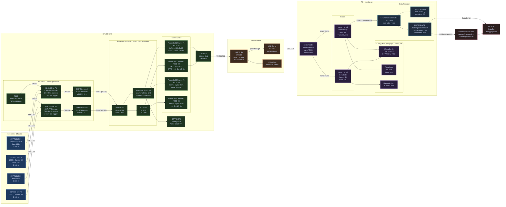

# Arquitetura — AccuEnergy Power Monitor



---

## Fluxo de amostragem — STM32H743

```mermaid
flowchart TD

  STM32([STM32H743])

  STM32      --> INIT
  INIT["Inicializa ADC1 DMA2\nTIM2 LPUART1 ST7735"]
  INIT       --> ADCCAL
  ADCCAL["Calibracao offset ADC\nHAL_ADCEx_Calibration_Start"]
  ADCCAL     --> CALIB

  CALIB["Calibra piso de ruido\n5 aquisicoes sem carga\ng_v_floor g_i_floor"]
  CALIB      --> STARTACQ

  STARTACQ["Inicia DMA2 + TIM2\nbuffer 2048 words\nV0 I0 V1 I1 ..."]
  STARTACQ   --> TRGO

  TRGO["TIM2 TRGO\n@ 15360 Hz\ndispara ADC1"]
  TRGO       --> ADCCONV
  ADCCONV["ADC1 converte\nCH3 tensao PA6\nCH4 corrente PC4\n16-bit por canal"]
  ADCCONV    --> DMAACC
  DMAACC["DMA2 Stream0\nacumula no buffer\ninterleaved"]
  DMAACC     --> Q1024{1024 pares\ncompletos?}

  Q1024 -->|nao| TRGO
  Q1024 -->|sim| ISR

  ISR["IRQ ConvCplt\nPara TIM2\nsamplesReady = 1"]
  ISR        --> DINT
  DINT["Deinterleave\nvRaw 1024\niRaw 1024"]
  DINT       --> CALC
  CALC["Calcula\nVrms Irms P Q S FP\nmed movel Irms N=5"]
  CALC       --> QFLOOR{Abaixo do\npiso de ruido?}

  QFLOOR -->|sim| ZERO["Zera grandezas\nVrms=0 Irms=0 P=0"]
  QFLOOR -->|nao| SEND1
  ZERO       --> SEND1

  SEND1["Envia Frame 0x01\nABCD 01 6xf32\n128x2xi16 EFFE\n543 bytes LPUART1"]
  SEND1      --> DISP
  DISP["Atualiza ST7735\nVrms Irms P FP\nuptime ADC raw"]
  DISP       --> QHARM{frame count\npercent 10 = 0?}

  QHARM -->|nao| RESTART
  QHARM -->|sim| GOERT
  GOERT["Goertzel h1..h50\npara V e I\nTHD_V THD_I"]
  GOERT      --> SEND2
  SEND2["Envia Frame 0x02\nABCD 02 2xf32\n100xf32 EFFE\n413 bytes LPUART1"]
  SEND2      --> RESTART

  RESTART["Reinicia DMA2 + TIM2\nproxima janela\n1024 amostras"]
  RESTART    --> QBTN{Botao PC13\npressionado?}

  QBTN -->|nao| TRGO
  QBTN -->|sim| STOPDMA
  STOPDMA["Para TIM2 + DMA\ndebounce 300 ms"]
  STOPDMA    --> CALIB

  LPUART([LPUART1\n460800 baud\nTX para ESP32])
  SEND1 -.-> LPUART
  SEND2 -.-> LPUART

  classDef actor   fill:#f4b8b8,stroke:#c98a9a,color:#222
  classDef process fill:#b8bef4,stroke:#8090c9,color:#111
  classDef decide  fill:#d0d2f0,stroke:#8090c9,color:#111

  class STM32,LPUART actor
  class INIT,ADCCAL,CALIB,STARTACQ,TRGO,ADCCONV,DMAACC,ISR,DINT,CALC,ZERO,SEND1,SEND2,DISP,GOERT,RESTART,STOPDMA process
  class Q1024,QFLOOR,QHARM,QBTN decide
```



---

## Resumo dos fluxos

### Fluxo de aquisição (hardware → firmware)
```
Rede elétrica
  ├─ ZMPT101B (Vtens) ──→ PA6 / ADC CH3 ─┐
  └─ SCT013-100 (Icorr) ─→ PC4 / ADC CH4 ─┤
                                            │
        TIM2 @ 15 360 Hz ──TRGO──→ ADC1 ──→ DMA2
                                            │
                                     2048 words
                                  [V₀ I₀ V₁ I₁ …]
```

### Fluxo de processamento (firmware → frames)
```
DMA ConvCplt IRQ
  └─→ Deinterleave  →  vRaw[1024]  iRaw[1024]
        ├─→ RMS / P / Q / S / FP  →  Frame 0x01  (543 B @ 15 Hz)
        └─→ Goertzel h1..h50      →  Frame 0x02  (413 B @  1.5 Hz)
                                          ↓
                                     LPUART1  460 800 baud
```

### Fluxo de comunicação (firmware → PC)
```
STM32 LPUART1 TX (frames 0x01-0x04, bifásico)
  └─→ ESP32-Bridge UART2 RX (GPIO16)  460 800 baud  RX buf 4 096 B (transparente)
        └─→ ESP32 USB Serial (UART0)  →  USB CDC VCP
              └─→ SerialReader thread  →  queue  →  GUI (30 ms poll)
```

A ESP32-Bridge é **byte-a-byte** (não interpreta frames), então os tipos de
fase 2 (`0x03`/`0x04`) passam sem mudança de lógica — só os buffers foram
ampliados (2 KB → 4 KB) para a rajada bifásica.

### Fluxo de gravação (GUI → NILMTK)
```
Sessão única (múltiplas cargas)          Múltiplas sessões
─────────────────────────────            ─────────────────
start("Ventilador")                      sessao1.h5
  append × N frames (F1 + F2)            sessao2.h5   ──→ consolidate_hdf5_files
stop()                                   sessao3.h5
start("Ferro")                                │
  append × M frames                           ↓
stop()                                   dataset_final.h5
  ↓
export_nilmtk_hdf5("dataset.h5")   ← 1 meter por fase, por segmento
  ├─ /building1/elec/meter1  ← Ventilador F1
  ├─ /building1/elec/meter2  ← Ventilador F2
  ├─ /building1/elec/meter3  ← Ferro F1
  └─ /building1/elec/meter4  ← Ferro F2
```

### Protocolo binário (frames do STM32)

Análise bifásica: cada fase tem um par de frames. A **fase 2** (ADC2, PA7/PC5)
usa os tipos `0x03`/`0x04` com **layout idêntico** aos da fase 1 (`0x01`/`0x02`) —
só muda o byte de tipo. O parser (`monitor.py`) reusa `parse_frame1`/`parse_frame2`.

| Campo         | Frame 0x01 Power F1 | Frame 0x02 Harm F1   | Frame 0x03 Power F2 | Frame 0x04 Harm F2 |
|---------------|---------------------|----------------------|---------------------|--------------------|
| Magic + tipo  | `AB CD 01`          | `AB CD 02`           | `AB CD 03`          | `AB CD 04`         |
| Payload       | Vrms Irms FP P Q S (6×f32) + 128 pares i16 | THD_V THD_I (2×f32) + harm_V[50] harm_I[50] (100×f32) | = 0x01 (fase 2) | = 0x02 (fase 2) |
| Footer        | `EF FE`             | `EF FE`              | `EF FE`             | `EF FE`            |
| Tamanho       | **543 bytes**       | **413 bytes**        | **543 bytes**       | **413 bytes**      |
| Taxa          | **~15 Hz**          | **~1.5 Hz**          | **~15 Hz**          | **~1.5 Hz**        |

> As duas fases amostram **em paralelo** (ADC1 + ADC2 no mesmo trigger TIM2),
> portanto adicionar a fase 2 **não aumenta o tempo de aquisição** por frame —
> apenas duplica os bytes transmitidos por janela (~2 KB/frame na LPUART).
